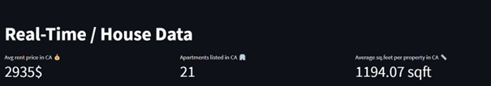
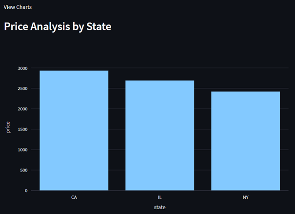

# Real-Time Big Data Housing Price Prediction

This project aims to predict housing rental prices in the USA based on property characteristics. It leverages various big data tools and technologies to process and analyze a large dataset of US rental listings from [Kaggle](https://www.kaggle.com/datasets/austinreese/usa-housing-listings).

## Table of Contents
- [Project Structure](#project-structure)
- [Tools/Technologies](#tools/technologies)
- [Components](#components)
- [Usage](#usage)
- [Requirements](#requirements)
- [Contributors](#contributors)
- [License](#license)

## Project Structure

- notebooks/
  - kafka/
    - kafka_consumer.ipynb
    - kafka_producer.ipynb
  - model/
    - Big_Data_Housing_Price_Prediction_Model_Training.ipynb
  - streaming/
    - streaming_prediction.ipynb
- web_app/
  - app.py
- README.md

## Tools/Technologies

- Apache Spark - Cluster computing engine for large-scale data processing
- Spark MLlib - Spark's machine learning library
- PySpark - Python API for Spark
- Apache Kafka - High throughput message broker
- HDFS - Distributed file storage system
- Streamlit - Framework for creating web apps

## Components

### Kafka

The Kafka component includes two notebooks:
- `kafka_producer.ipynb`: This notebook generates fake housing data and sends it to a Kafka topic, simulating real-time data ingestion.
- `kafka_consumer.ipynb`: This notebook sets up a Kafka consumer to ingest data, process it, and store it in HDFS.

### Model Training

The `Big_Data_Housing_Price_Prediction_Model_Training.ipynb` notebook is responsible for training machine learning models using PySpark. It covers data preprocessing, feature engineering, model training, hyperparameter tuning, and model evaluation.

### Real-Time Streaming

The `streaming_prediction.ipynb` notebook sets up a real-time streaming application that reads data from Kafka, applies a pre-trained machine learning model for prediction, and provides real-time insights into housing prices.

### Web Application

The `app.py` file contains the code for a Streamlit web application. It offers a user-friendly interface to explore real-time Key Performance Indicators (KPIs) and visualizations based on the processed housing data.

## Usage

### Create a New Conda Environment

Before running the project, it's recommended to create a new Conda environment to manage dependencies. You can do this using the following commands:

-conda create --name project-env python=3.8

### Activate the Conda Environment

-conda activate project-env

### Install Dependencies from 'requirements.txt'

-pip install -r requirements.txt

### Run the Project 

With your Conda environment activated and dependencies installed, the various components of the project can now be run as described in the Components section of the README. Follow the instructions provided in each component's description to execute the code and analyze the data.
Note: The code uses placeholders like 'CLUSTER_URL_HERE' for paths and URLs related to the college's cluster. You'll need to update these placeholders to work with a different HDFS environment.

## Contributors

- Miguel Fernandes

Contributions to this project are welcome! If you have any suggestions or improvements, please feel free to open an issue or create a pull request.

## License

This project is licensed under the [MIT License](LICENSE).

